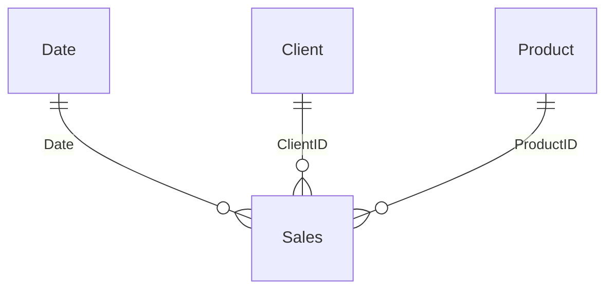

# Model gwiazdy

```mermaid
erDiagram
    Date ||--o{ Sales : "Date"
    Client ||--o{ Sales : "ClientID"
    Product ||--o{ Sales : "ProductID"
```

Jedna pozycja faktury sprzedaży (LineID), przypisana do jednej wysyłki. Filtry przepływają wyłącznie z wymiarów do faktów. Nie łączymy tabel faktów bezpośrednio. 
